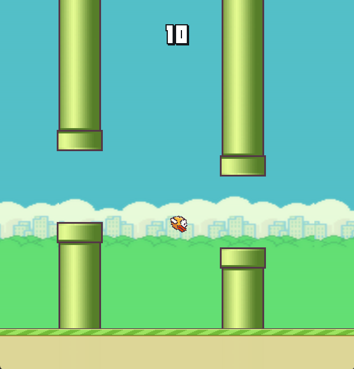
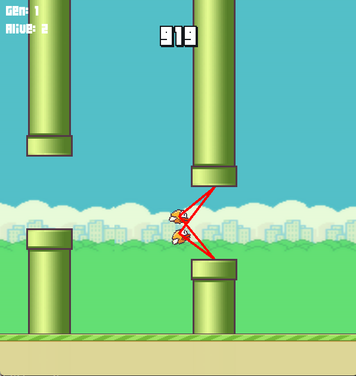
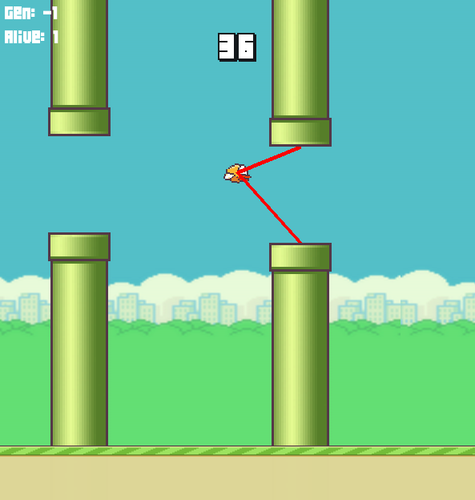

# Flappy bird
Flappy bird using pygame, with AI functionality using NEAT.

## Required installation
```python
pip install pygame
pip install neat-python
```
## Running the Program
```python
py main.py # Launch the original flappy bird game
py mainAI.py -train # Train an A.I using NEAT for the flappy bird game
py mainAI.py -test # Test trained A.I (Genome) for the flappy bird game 
```

# Description 
## Main.py / Basic Flappy bird game
Click on the screen to make the bird jump and avoid falling or hitting the pipes. The score is based on the number of pipe passed.




## MainAI.py / Training & Testing the A.I

During the training phase of the agent, additional information will be displayed on the screen:
- Current Generation
- Number of birds alive (initially 50 in each generation)
- Red line indicating which pipe the bird is looking at



The training phase will end when one of the conditions meet:
 - Score reaches 8000
 - Generation reaches 30 (unlikely since flappy bird is a simple game, only fewer than 10 generations is needed to create an adequate intelligent agent)
 - Fitness value reaches the maximum threshold given in the neat configuration file when a generation ends
 
 Once the training phase has ended, the best genome will be automatically saved in the file "bestGenome.pickle". Use the "-test" as indicated
 to test the completed A.I agent
 

 
# Controls
**Left click / A**: Jump

# Additional Information

**Neat fitness value system:**
  - Fitness function used: the amount of time (frame) stays alive + number of pipe passed through
  - Penalty: Colliding with the pipe + bird died

**Three neurons as input:**
- horizontal distance between the bird and the next closest pipe
- vertical distance between the bird and the top pipe
- vertical distance between the bird and the bottom pipe

**Activation function used:**
 - tanh (range of values between (-1, 1) )

**One neuron as ouput:**
- make a jump if output value $\ge$ 0.5
